# Upsun Manager

Dashboard de gestion pour les projets [Upsun](https://upsun.com) (Platform.sh). Surveillez vos environnements, ressources, logs, alertes, autoscaling, intégrations CI/CD et bien plus depuis une interface unifiée — disponible en application desktop pour Linux, Windows et macOS.

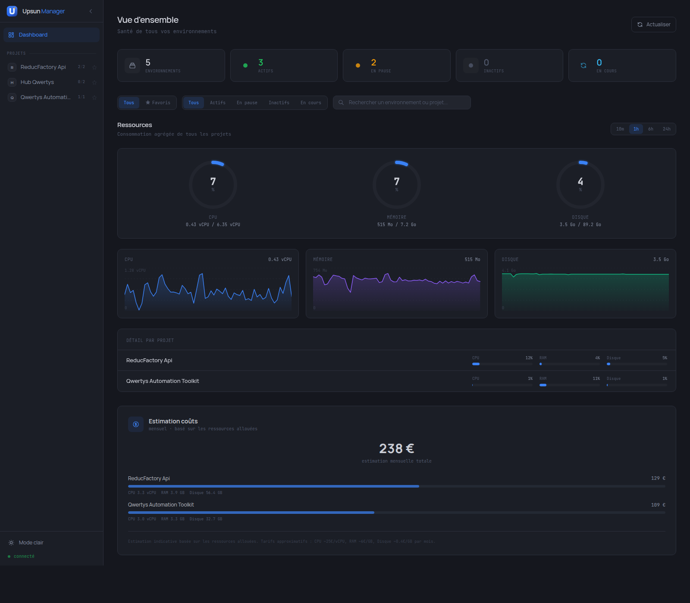

## Fonctionnalités

### Pilotage quotidien

#### Dashboard global
Vue d'ensemble multi-projets avec :
- Statistiques en temps réel (environnements actifs, en pause, inactifs, en cours)
- Consommation agrégée CPU / Mémoire / Disque avec donut charts et time series
- Filtres par statut + favoris
- Détail par projet avec barres de progression

#### Environnements & ressources
- Liste des environnements avec statut, type et actions rapides (redéploiement, pause, reprise, activation, suppression, branchement)
- Jauges CPU / mémoire / disque par environnement avec graphes interactifs
- Polling automatique pendant les opérations
- Accès rapide aux URLs, SSH et Git de chaque environnement

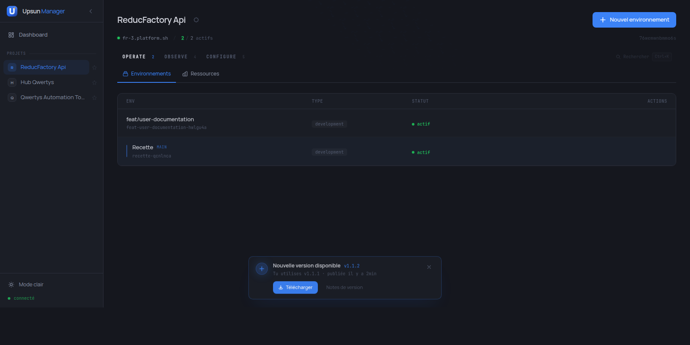
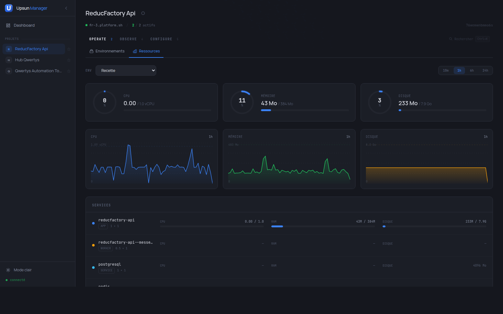

### Diagnostic & investigation

#### Logs applicatifs
Streaming des logs récents (app, workers, crons) avec :
- Détection automatique du niveau (error / warning / notice / info / debug)
- Filtres par service, niveau et recherche full-text
- Auto-refresh toggleable
- Copie / scroll-to-end

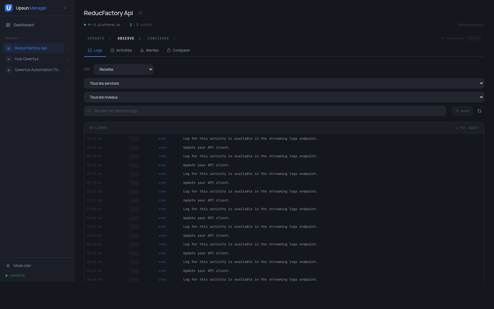

#### Activités
- Timeline des déploiements, crons, backups, modifications de variables
- Filtres par environnement et type d'activité
- Logs détaillés accessibles au clic
- Pagination infinie

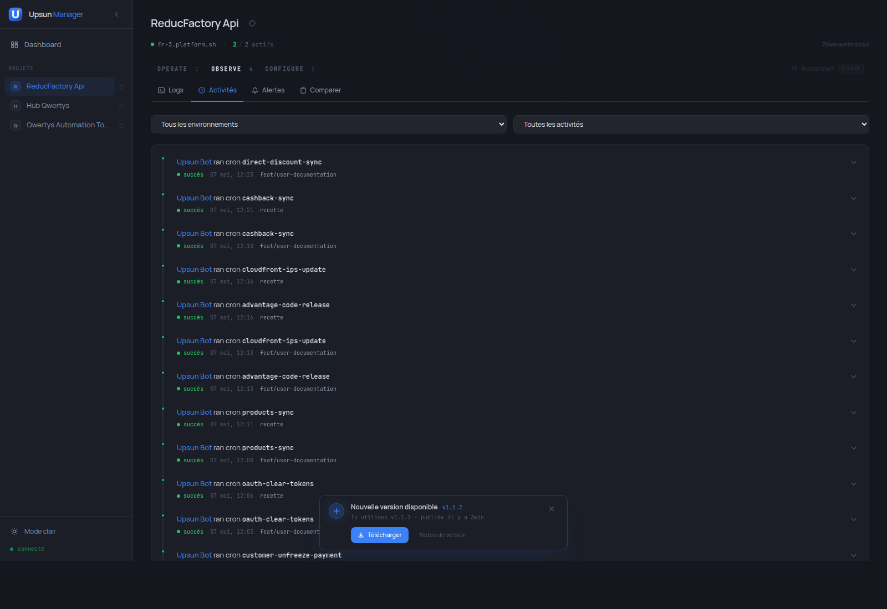

#### Comparaison d'environnements
Diff côté-à-côte de deux environnements sur :
- Variables d'environnement (ajoutées, supprimées, modifiées)
- Routes
- Ressources allouées (CPU, mémoire, disque, instances)

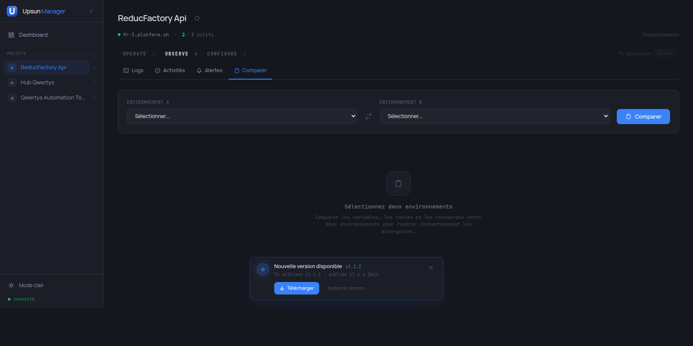

#### Alertes & notifications
- Canaux configurables : Slack, Discord, webhook générique, email
- Règles d'alerte sur métriques (CPU, mémoire, disque) avec seuils + durées
- Historique des notifications déclenchées

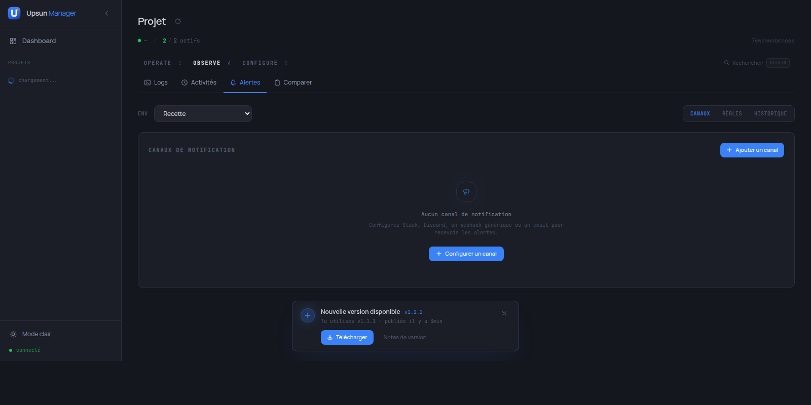

### Configuration

#### Variables d'environnement
- Visualisation et gestion par environnement
- Création, modification, suppression
- Support des flags : JSON, sensible, build/runtime

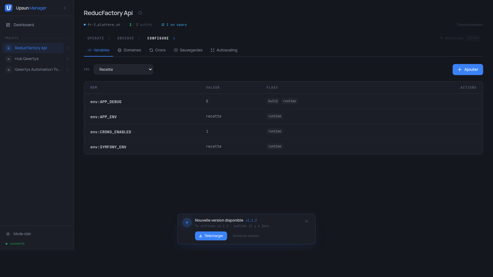

#### Domaines & certificats SSL
- Gestion des domaines par environnement
- Indicateurs d'expiration des certificats avec niveau d'urgence

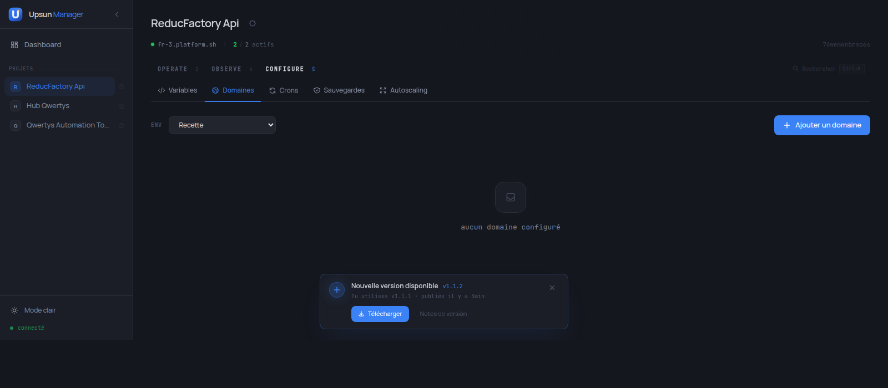

#### Crons
- Historique des exécutions avec stats (taux de succès, durée, dernier run)
- Liens vers les logs détaillés

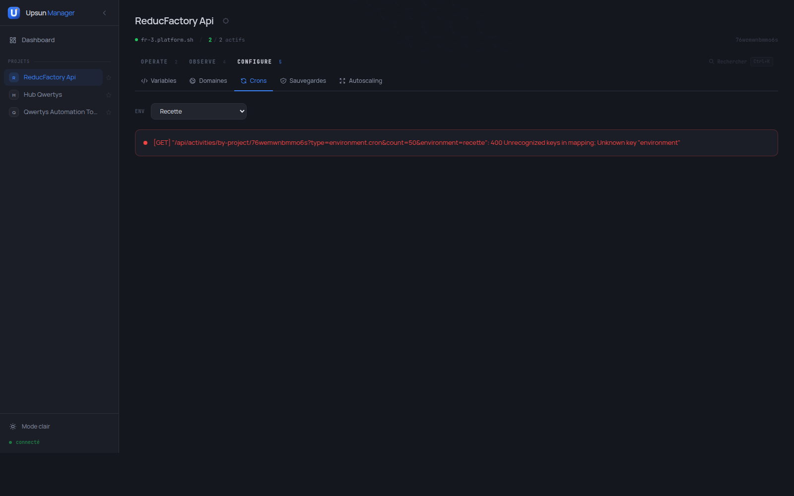

#### Sauvegardes
- Liste des backups avec statut et date
- Création manuelle, restauration avec confirmation

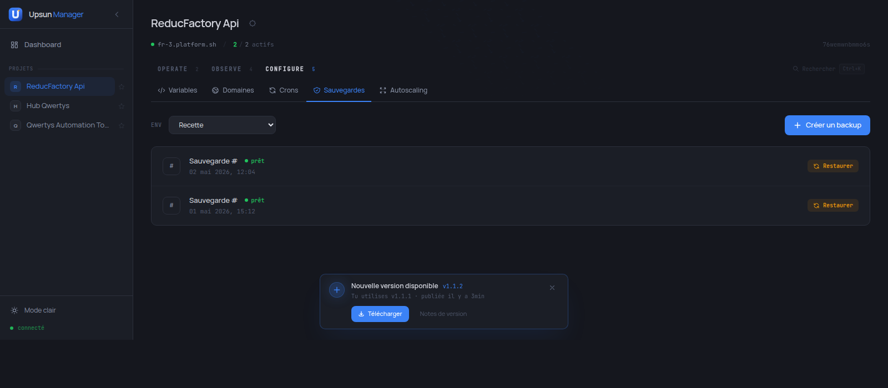

#### Autoscaling natif Upsun
Frontend pour l'autoscaling natif d'Upsun (`/autoscaling/settings`). L'app pilote la configuration ; **Upsun fait l'évaluation et les actions côté infra**, en continu, même quand l'app n'est pas ouverte :

- Configuration par service : 4 déclencheurs (CPU, mémoire, **CPU pressure**, **mémoire pressure** PSI Linux)
- Pour chaque déclencheur : seuils up/down avec durées séparées + visualisation des seuils sur barre 0-100 %
- Bornes par service : `instances` min/max, `resources.cpu` min/max, `resources.memory` min/max
- Cooldowns up/down + facteurs de scaling configurables
- Activation en 1 clic sur tous les services avec preset équilibré, ou config par service
- Pas de moteur custom à maintenir : Upsun ajuste à chaud, sans redéploiement complet

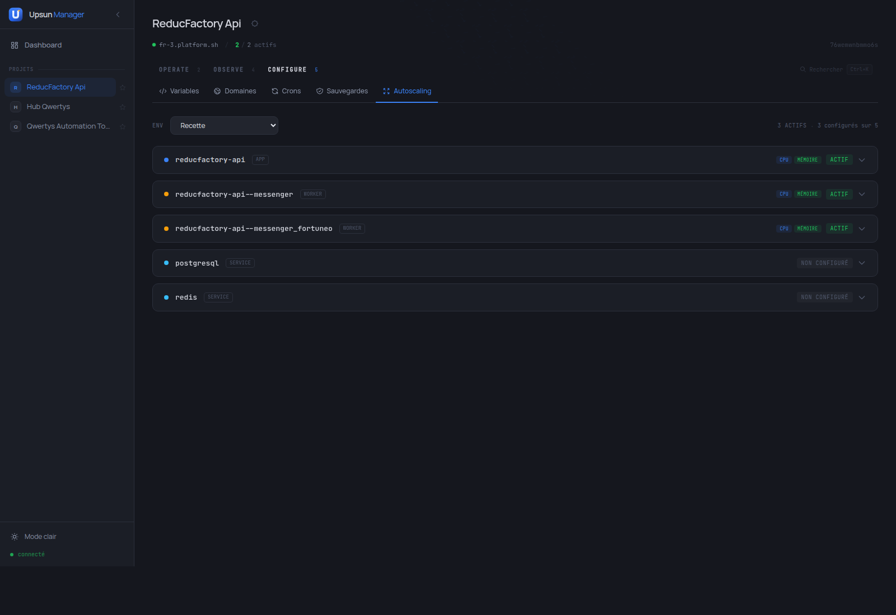

### Administration projet

#### Intégrations CI/CD
- GitHub, GitLab, Bitbucket, webhooks génériques, Slack, email santé
- Création, validation et suppression sans quitter le dashboard

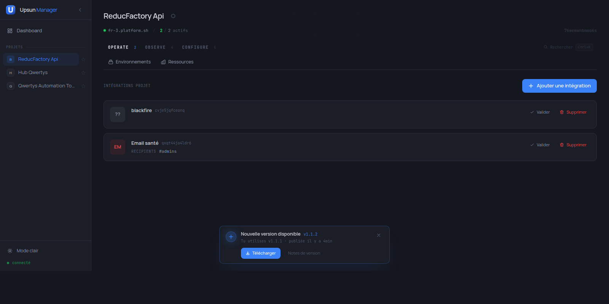

#### Équipe & accès
- Liste des membres avec rôles (Admin / Contributor / Viewer)
- Invitation par email + suppression d'accès

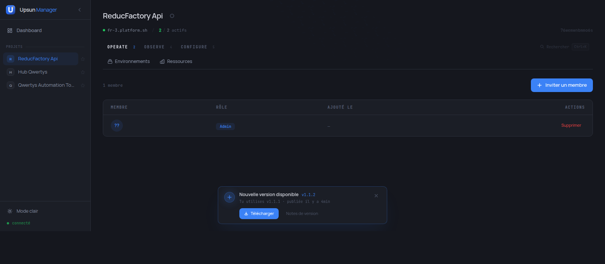

#### Apparence par organisation
8 palettes d'accent paramétrables au niveau organisation, persistées et synchronisées entre tous les utilisateurs. Le thème survit au toggle clair/sombre.

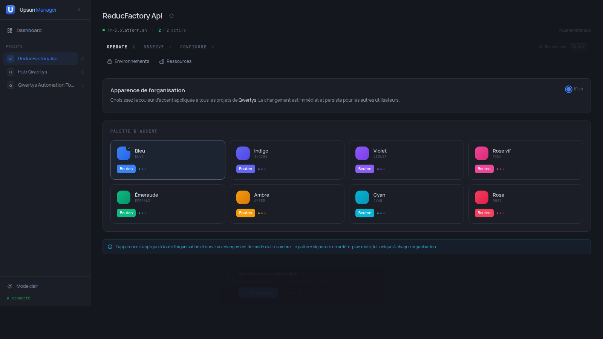

### Premier démarrage

#### Saisie du token API
Au tout premier lancement, l'app demande votre token API Upsun via une interface dédiée. Le token est ensuite chiffré et stocké localement via Electron `safeStorage` — il ne quitte jamais votre machine.

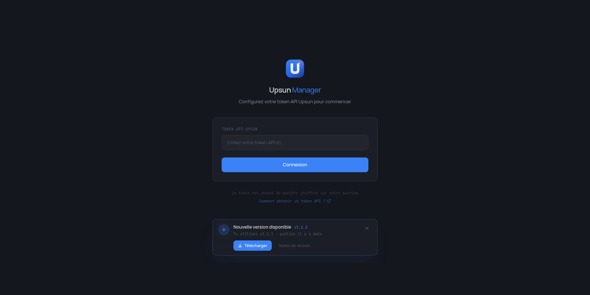

#### Tableau de bord vide
Si aucun projet n'est encore visible (token configuré mais aucun projet créé sur Upsun), un guide pas-à-pas s'affiche pour vous orienter vers les premières étapes.

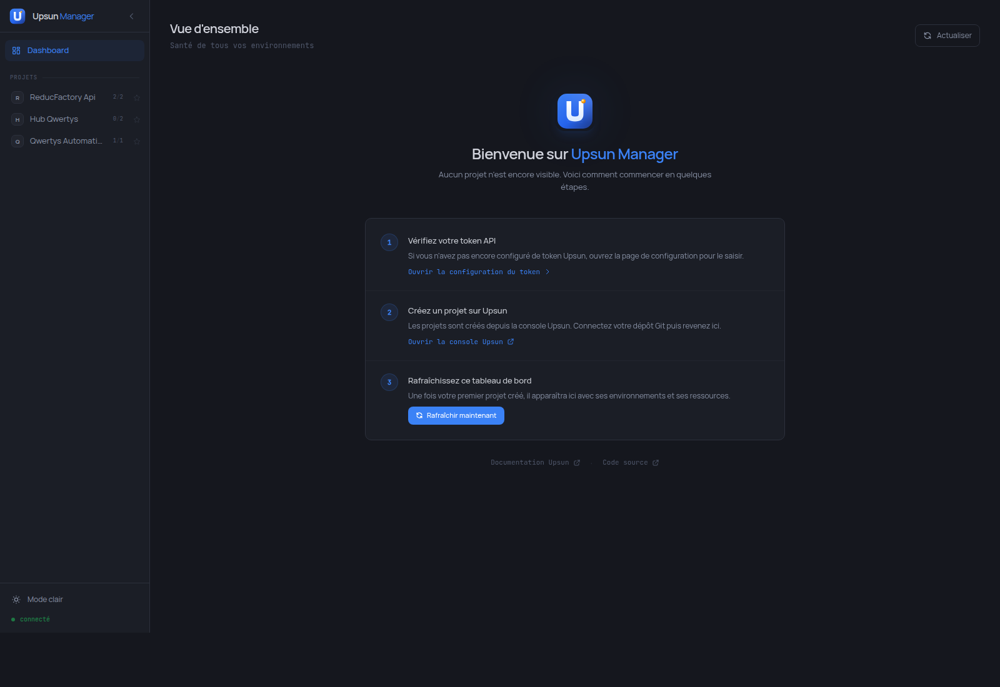

### Productivité

- **Palette de commandes ⌘K** : recherche fuzzy sur tous les panels et environnements du projet courant
- **Pattern signature génératif** : chaque organisation reçoit un motif unique en arrière-plan (dérivé de son ID)
- **Vérification de version automatique** : l'app vérifie GitHub Releases au démarrage et toutes les heures. En desktop, `electron-updater` télécharge la mise à jour en arrière-plan ; en web, un banner discret en bas d'écran propose le téléchargement direct du binaire correspondant à l'OS détecté.
- **Skip-link & focus-visible** : navigation clavier soignée, conforme aux bonnes pratiques d'accessibilité

## Stack technique

| Composant | Technologie |
|-----------|-------------|
| Frontend | Nuxt 3.21 (SPA) |
| State management | Pinia (composition API) |
| Styling | Tailwind CSS + thème dark Graphite |
| Fonts | Manrope (sans) + JetBrains Mono (mono) |
| Backend | Nitro server routes (proxy API Upsun) |
| Auth | OAuth2 token exchange via Platform.sh |
| Desktop | Electron 41 + electron-builder + electron-updater |
| CI/CD | GitHub Actions (Linux + Windows + macOS) |

## Téléchargement

Les binaires pré-compilés sont disponibles sur la page [Releases](https://github.com/tdubuffet-lephare/upsun-manager/releases).

### Linux

| Format | Distributions cibles | Installation |
|---|---|---|
| `.AppImage` | Toutes (universel) | `chmod +x Upsun-Manager-*.AppImage && ./Upsun-Manager-*.AppImage` |
| `.deb` | Debian, Ubuntu, Mint, Pop!_OS | `sudo dpkg -i Upsun-Manager-*.deb` |
| `.rpm` | Fedora, RHEL, Rocky, openSUSE | `sudo rpm -i Upsun-Manager-*.rpm` |

### Windows

1. Télécharger `Upsun-Manager-Setup-*.exe` (installeur) ou `Upsun-Manager-*-portable.exe` (sans installation).
2. Au premier lancement, Windows SmartScreen affiche un avertissement : cliquer **Plus d'infos** puis **Exécuter quand même**.
3. L'exécutable n'est pas signé par un certificat EV payant — l'avertissement est normal.

### macOS

1. Télécharger `Upsun-Manager-*-arm64.dmg` (Apple Silicon) et glisser l'app dans Applications.
2. Au premier lancement : **clic-droit sur l'icône > Ouvrir** (au lieu d'un double-clic).
3. Confirmer dans la boîte de dialogue Gatekeeper.
4. L'app n'est pas notarisée Apple — le clic-droit est nécessaire uniquement la première fois.

L'auto-update est intégré : à chaque démarrage, l'app vérifie si une nouvelle version existe et la télécharge en arrière-plan.

## Installation depuis les sources

```bash
git clone https://github.com/tdubuffet-lephare/upsun-manager.git
cd upsun-manager
npm install
```

## Configuration

Créer un fichier `.env` à la racine :

```env
NUXT_UPSUN_API_TOKEN=your-upsun-api-token
```

Le token API Upsun se génère depuis [console.upsun.com](https://console.upsun.com) > Account Settings > API Tokens.

En mode Electron, le token est demandé au premier démarrage via une interface dédiée et stocké de manière chiffrée via Electron `safeStorage`.

## Utilisation

### Mode web

```bash
# Développement
npm run build && npx nuxt preview --port 3002

# Production
npm run build
node .output/server/index.mjs
```

### Mode Electron (desktop)

```bash
# Dev
npm run electron:dev

# Package (répertoire)
npm run electron:pack

# Distribution (installeur local)
npm run electron:dist
```

### Docker (compilation multi-plateforme locale)

```bash
# Linux (AppImage + deb + rpm)
make dist-linux

# Windows (via Wine)
make dist-windows

# Les deux
make dist-all
```

### Release multi-plateforme automatisée

Le workflow GitHub Actions `.github/workflows/release.yml` build automatiquement Linux, Windows et macOS en parallèle quand un tag `v*.*.*` est poussé :

```bash
npm version 1.1.0 --no-git-tag-version
git add package.json package-lock.json
git commit -m "chore: release v1.1.0"
git tag v1.1.0
git push origin main --tags
```

Les artifacts sont publiés automatiquement sur la page Releases du repo.

## Architecture

```
pages/                          # Dashboard + page projet
components/                     # ~50 composants Vue
  ProjectNav.vue                # Nav 2 niveaux (Operate / Observe / Configure)
  ProjectVitalSigns.vue         # Barre de stats compacte
  ProjectSettingsMenu.vue       # Menu engrenage projet
  CommandPalette.vue            # Palette ⌘K
  OrgPattern.vue                # Pattern signature génératif
  OrgThemeSettings.vue          # Picker de couleurs par organisation
  EmptyState.vue / LoadingState.vue / ErrorState.vue
  ...
composables/
  useCommandPalette.ts
  useOrgPattern.ts              # Génération déterministe par hash d'org
  useOrgTheme.ts                # Application des CSS variables d'accent
  useProjectSections.ts         # Définition de la nav projet
  useUpdateChecker.ts           # Vérification GitHub Releases + version locale
  useFavorites.ts
  ...
stores/                         # 15 Pinia stores (composition API)
  dashboard.ts                  # Agrégation multi-projets
  metrics.ts / environments.ts / autoscaling.ts
  logs.ts / notifications.ts / integrations.ts / access.ts
  compare.ts / orgThemes.ts
  ...
types/                          # Domaine fortement typé
  notification.ts               # Tagged unions par type de canal
  integration.ts                # Tagged unions par type d'intégration
  log.ts / orgTheme.ts / access.ts
  ...
utils/
  format.ts                     # formatBytes, formatCpu, formatPercent
  date.ts / error.ts / metrics.ts
  diff.ts / diff-formatters.ts  # Comparaison d'environnements
server/
  api/                          # ~50 routes Nitro
    notifications/ integrations/ access/ org-themes/ logs/
    environments/compare/ ...
  utils/
    upsun-auth.ts               # OAuth2 token exchange
    upsun-client.ts             # Client HTTP avec retry 401
    upsun-metrics.ts            # Service typé d'extraction de métriques
    log-parser.ts               # Parser logs Upsun (JSONL streaming)
    notification-engine.ts      # Évaluation périodique des alertes (60s)
    storage-keys.ts             # Clés Nitro storage centralisées
    validation.ts               # Validation des inputs API
  plugins/
    notifications.ts            # Démarrage du moteur d'alertes
electron/                       # Process Electron
  main.ts                       # Lifecycle + IPC + auto-updater
  preload.ts                    # Pont vers le renderer
  token-store.ts                # Stockage chiffré via safeStorage
  nitro-server.ts               # Serveur Nitro embarqué
.github/workflows/
  release.yml                   # Build + publish 3 OS sur tag v*.*.*
  build-pr.yml                  # Validation PR (Linux only)
```

## Licence

ISC
