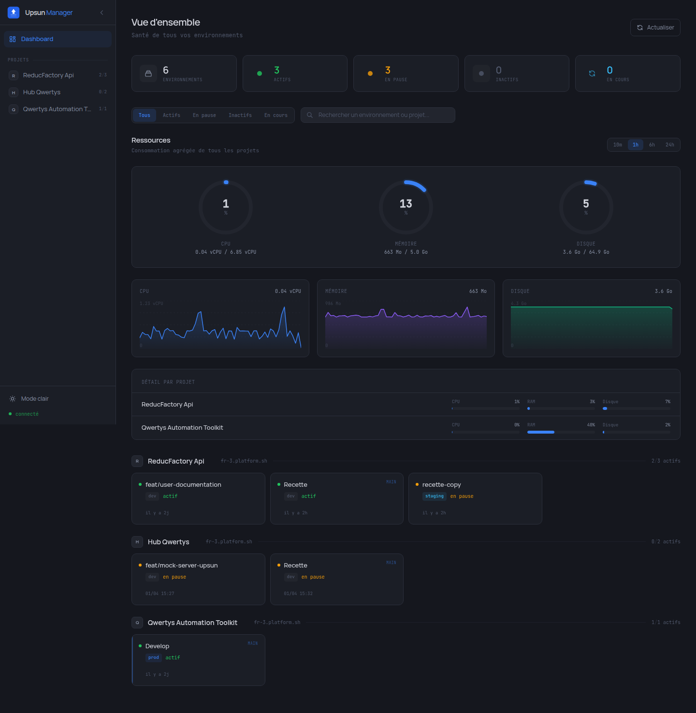

# Upsun Manager

Dashboard de gestion pour les projets [Upsun](https://upsun.com) (Platform.sh). Surveillez vos environnements, ressources, activités et configurez l'autoscaling depuis une interface unifiée.


## Fonctionnalités

### Dashboard global

Vue d'ensemble de tous vos projets et environnements avec :
- Statistiques en temps réel (environnements actifs, en pause, inactifs)
- Consommation agrégée CPU / Mémoire / Disque avec donut charts
- Graphes de time series sur 10min, 1h, 6h ou 24h
- Détail par projet avec barres de progression



### Gestion des environnements

- Liste des environnements avec statut, type et actions rapides
- Activation, mise en pause, reprise, redéploiement, suppression
- Création de branches (nouvel environnement)
- Polling automatique pendant les opérations


### Monitoring des ressources

- Jauges CPU, mémoire et disque par environnement
- Graphes d'utilisation interactifs avec tooltip au survol
- Détail par service (app, worker, service) avec profil et instances
- Accès rapide aux URLs, SSH et Git de l'environnement


### Historique des activités

- Timeline des déploiements, crons, backups, modifications de variables
- Filtres par environnement et type d'activité
- Logs détaillés accessibles au clic
- Pagination infinie


### Variables d'environnement

- Visualisation et gestion des variables par environnement
- Création, modification et suppression
- Support des flags : JSON, sensible, visible au build/runtime


### Sauvegardes

- Liste des backups avec statut et date
- Création de nouvelles sauvegardes
- Restauration avec confirmation

### Domaines

- Gestion des domaines par environnement
- Ajout et suppression de domaines
- Indicateur SSL

### Autoscaling

- Moteur d'autoscaling intégré (pas d'API Upsun native)
- Configuration par service : CPU, mémoire, disque
- Presets rapides : Conservateur, Equilibre, Agressif
- Analyse intelligente avec recommandations basées sur 24h de données
- Historique des actions de scaling


## Stack technique

| Composant | Technologie |
|-----------|-------------|
| Frontend | Nuxt 3.21 (SPA) |
| State management | Pinia (composition API) |
| Styling | Tailwind CSS + theme dark Graphite |
| Fonts | Manrope (sans) + JetBrains Mono (mono) |
| Backend | Nitro server routes (proxy API Upsun) |
| Auth | OAuth2 token exchange via Platform.sh |
| Desktop | Electron (optionnel) |
| Build desktop | Docker + Makefile |

## Installation

```bash
git clone https://github.com/tdubuffet/upsun-manager.git
cd upsun-manager
npm install
```

## Configuration

Creer un fichier `.env` a la racine :

```env
NUXT_UPSUN_API_TOKEN=your-upsun-api-token
```

Le token API Upsun se genere depuis [console.upsun.com](https://console.upsun.com) > Account Settings > API Tokens.

## Utilisation

### Mode web

```bash
# Developpement
npm run build && npx nuxt preview --port 3002

# Production
npm run build
node .output/server/index.mjs
```

### Mode Electron (desktop)

```bash
# Dev
npm run electron:dev

# Package (repertoire)
npm run electron:pack

# Distribution (installeur)
npm run electron:dist
```

### Docker (compilation multi-plateforme)

```bash
# Linux (AppImage + deb)
make dist-linux

# Windows (via Wine)
make dist-windows

# Les deux
make dist-all
```

## Architecture

```
pages/                          # Dashboard + page projet
components/                     # ~35 composants Vue
  LoadingState.vue              # Etats partagés
  EmptyState.vue
  ErrorState.vue
  AreaChart.vue                 # Graphes SVG interactifs
  DonutChart.vue                # Jauges circulaires
  ...
composables/                    # Logique reutilisable
  useClipboard.ts
  useEnvironmentSelection.ts
  useToast.ts
  useElectron.ts
stores/                         # 9 Pinia stores
  dashboard.ts                  # Agregation multi-projets
  metrics.ts                    # Metriques par environnement
  environments.ts               # CRUD + polling
  autoscaling.ts                # Config + recommandations
  ...
utils/                          # Fonctions utilitaires
  format.ts                     # formatBytes, formatCpu, formatPercent
  date.ts                       # formatDate, formatRelativeTime
  error.ts                      # extractErrorMessage
  metrics.ts                    # parseMetricsResponse, summarizeServices
server/
  api/                          # ~31 routes Nitro
  utils/
    upsun-auth.ts               # OAuth2 token exchange
    upsun-client.ts             # Client HTTP avec retry 401
    env-action-handler.ts       # Factory pour les actions env
    autoscaling-engine.ts       # Moteur d'evaluation periodique
  plugins/
    autoscaling.ts              # Demarrage automatique du moteur
electron/                       # Process Electron (optionnel)
  main.ts
  preload.ts
  token-store.ts                # Stockage chiffre via safeStorage
  nitro-server.ts               # Serveur Nitro embarque
```

## Licence

ISC
